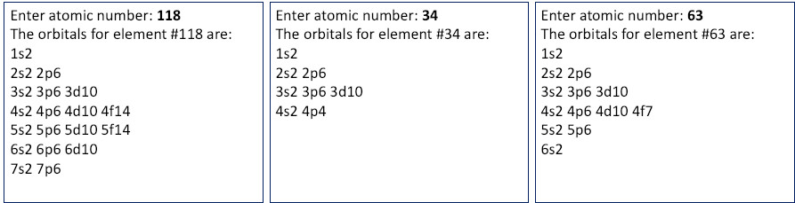

# HW4 Assignments/Explanations

------

## Problem 1: The Prime Numbers

------

Write a C program to help someone know all the prime numbers in the range of 1-500. The program will print out all prime numbers within the range of 1 to 500 as well as the total count of prime numbers in that range. This will be done through computation without relying on a pre-existing list of prime numbers.

## Problem 2: Electron Orbitals

------

Write a C program to prompt the user for an atomic number, and the program will print out the electron orbital chart for that element.  If the user enters a number outside the periodic chart (e.g. above 118) give an error message of "Number is outside the range of atomic numbers." and exit.  The output will be an orbital chart, where each entry will contain the orbit number (1-7) followed by the orbital type (s, p, d, f) and finally the number of electrons that are in that orbital.  If the final orbital is not fully populated, it should print the actual number of electrons there, not the total possible.  See below for some sample output runs.

